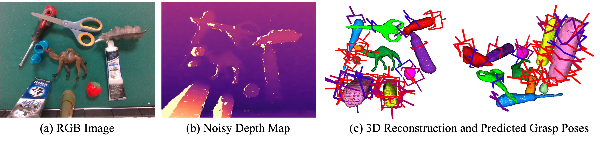

# ZeroGrasp: Zero-Shot Shape Reconstruction Enabled Robotic Grasping



**Zero-Shot Shape Reconstruction Enabled Robotic Grasping**<br>
[Shun Iwase](https://sh8.io/#/),
[Muhammad Zubair Irshad](https://zubairirshad.com/),
[Katherine Liu](https://www.thekatherineliu.com/),
[Vitor Guizilini](https://vitorguizilini.weebly.com/),
[Robert Lee](https://www.linkedin.com/in/robert-lee-a8a98922b),
[Ayako Amma](),
[Takuya Ikeda](https://www.linkedin.com/in/takuya-ikeda-a66132190/),
[Koichi Nishiwaki](https://www.linkedin.com/in/knishiwaki/),
[Kris Kitani](https://kriskitani.github.io/),
[Rareș Ambruș](https://www.tri.global/about-us/dr-rares-ambrus),
[Sergey Zakharov](https://zakharos.github.io/)<br>
**[Paper](https://arxiv.org/abs/2504.10857v1), [Project Page](https://sh8.io/#/zerograsp)**

## Abstract

Robotic grasping is a cornerstone capability of embodied systems. Many methods directly output grasps from partial information without modeling the geometry of the scene, leading to suboptimal motion and even collisions. To address these issues, we introduce ZeroGrasp, a novel framework that simultaneously performs 3D reconstruction and grasp pose prediction in near real-time. A key insight of our method is that occlusion reasoning and modeling the spatial relationships between objects is beneficial for both accurate reconstruction and grasping. We couple our method with a novel large-scale synthetic dataset, which is an order of magnitude larger than existing datasets and comprises 1M photo-realistic images, high-resolution 3D reconstructions and 11.3B physically-valid grasp pose annotations for 12K objects from the Objaverse-LVIS dataset. We evaluate ZeroGrasp on the GraspNet-1B benchmark as well as through real-world robot experiments. ZeroGrasp achieves state-of-the-art performance and generalizes to novel real-world objects by leveraging synthetic data.

## News
- 2025-02-26: ZeroGrasp is accepted by CVPR 2025

## Prerequisites
- Docker

## Environment Setup

### Build a docker image

```
$ git clone --recursive git@github.com:TRI-ML/ZeroGrasp.git
$ git submodule update --init --recursive
$ cd ZeroGrasp
$ ./docker/build.sh
```

### Run a docker image

```
$ ./docker/run.sh ${GPU_IDS}
```

## Dataset Preparation

Please reach out to `siwase@cs.cmu.edu` to get access to the ZeroGrasp-11B dataset. I will share its Google drive link within a few days. Since [Webdataset](https://github.com/webdataset/webdataset) is used for training and evaluation, you have to re-upload the shard files to your own S3 bucket for training. **Do not forget to replace `{your_s3_path}` in `configs/default.yaml` with your S3 path.** You can also download a tiny version of the training dataset (the first 10 shards of the training dataset) in `train_tiny` directory for visualization purposes.

## Quickstart

### Training

```
# From scratch
$ ./scripts/train.sh {your_wandb_project_name} {your_wandb_run_name} ./configs/default.yaml

# From a checkpoint
$ ./scripts/train.sh {your_wandb_project_name} {your_wandb_run_name} ./configs/default.yaml {path_to_checkpoint_file}
```

### Demo
Please download the pretrained checkpoint from [here](https://drive.google.com/file/d/1xUmFdgT_Ozu4zIPIsh_1SJMcegeQUWqQ/view?usp=sharing). Note that this checkpoint is only trained with the synthetic data. The depth maps from stereo matching algorithms (e.g., [FoundationStereo](https://github.com/NVlabs/FoundationStereo/), [DEFOM-Stereo](https://github.com/Insta360-Research-Team/DEFOM-Stereo)) are preferable to see the best performance.
```
$ python3 demo.py --img_path demo/000.rgb.png --depth_path demo/000.depth.png --mask_path demo/000.mask.png --camera_info_path demo/000.camera.json --checkpoint checkpoints/mirage_cvpr2025/mirage/epoch=1-step=80000.ckpt --config configs/demo.yaml
```

## Citation
```
@InProceedings{Iwase_CVPR_2025,
  title     = {{ZeroGrasp: Zero-Shot Shape Reconstruction Enabled Robotic Grasping}},
  author    = {Iwase, Shun and Irshad, Muhammad Zubair and Liu, Katherine and Guizilini, Vitor and Lee, Robert and Ikeda, Takuya and Ayako, Amma and Nishiwaki, Koichi and Kitani, Kris and Ambru{\c{s}}, Rare{\c{s}} and Zakharov, Sergey},
  booktitle = {CVPR},
  year      = {2025}
}
```

## License
This repository is released under the [CC BY-NC 4.0](https://github.com/TRI-ML/ZeroGrasp/blob/main/LICENSE.md) license.
